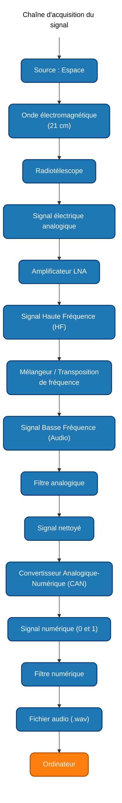

# Projet – Traitement du Signal : Signal radio du radiotélescope de Nançay

Projet de Traitement du Signal – CESI A1

Ce projet consiste à analyser un signal radio atypique détecté par le radiotélescope décimétrique de Nançay, dans la raie dite des 21 cm de l’hydrogène neutre (environ 1420 MHz). Cette raie est utilisée en radioastronomie pour étudier la structure de notre galaxie.

Le signal a été transposé en bande audio afin de pouvoir être écouté et étudié comme un signal sonore classique.

---

## 1. Objectif global du projet

L’objectif du projet est de suivre la chaîne complète de traitement d’un signal, depuis la réception par le radiotélescope jusqu’à une éventuelle interprétation du contenu (message, motif, etc.).

Le travail est découpé en 4 livrables successifs qui permettent de :

- comprendre et vulgariser le contexte scientifique (Nançay, raie 21 cm, transposition de fréquence) ;
- concevoir un filtrage analogique adapté ;
- mettre en place un filtrage numérique et une chaîne de réception ;
- réfléchir à une chaîne de transmission complète (émission + réception).

---

## 2. Description des livrables

### Livrable 1 – Vulgarisation scientifique et première analyse

- Expliquer, de façon vulgarisée, comment on passe d’une onde électromagnétique dans l’espace à un signal audio que l’on peut écouter.
- Décrire la chaîne d’acquisition du signal :

- Préciser la nature du signal à chaque étape (EM, RF, analogique, numérique, audio).
- Introduire les notions clés :
  - raie 21 cm de l’hydrogène neutre (longueur d’onde ≈ 21 cm, fréquence ≈ 1420 MHz) ;
  - relation c = λ × f ;
  - théorème de Nyquist (fréquence d’échantillonnage au moins égale à deux fois la fréquence maximale du signal) ;
  - transformée de Fourier (FFT) pour analyser le spectre d’un signal.
- Réaliser une première analyse du fichier audio :
  - calcul d’une FFT et affichage du spectre ;
  - calcul d’un spectrogramme (temps–fréquence) ;
  - premiers commentaires sur le bruit et les fréquences visibles.

Le livrable est rendu sous forme de notebook Jupyter (texte Markdown, formules LaTeX, schéma Mermaid).

### Livrable 2 – Filtre analogique

- Proposer un filtre analogique pour débruiter le signal avant la numérisation.
- Choisir un type de filtre (passe-bas, passe-haut, passe-bande, coupe-bande, etc.) en s’appuyant sur les résultats du livrable 1 (spectre, bruit, fréquence d’intérêt).
- Dimensionner le filtre (fréquence(s) de coupure, ordre, etc.) et discuter des compromis (bande passante, atténuation).
- Tester le filtre à l’aide d’un montage (par exemple carte son et logiciel de mesure).

### Livrable 3 – Chaîne de réception numérique

- Mettre en place le traitement numérique du signal après numérisation.
- Implémenter des filtres numériques adaptés (FIR/IIR).
- Mettre en œuvre, selon le sujet exact, des briques de modulation/démodulation, codage/décodage, etc.
- Évaluer la qualité du signal filtré (spectre, spectrogramme) et analyser s’il existe un contenu d’intérêt dans le message reçu.

### Livrable 4 – Chaîne de transmission complète

- Proposer une chaîne de transmission complète (émission + réception) en s’appuyant sur les blocs conçus dans les livrables 2 et 3.
- Décrire les différentes étapes : génération du signal, éventuelle modulation, filtrage, émission, propagation, réception, filtrage, démodulation, décodage.
- Discuter des contraintes pratiques : bruit, bande passante, fréquence porteuse, choix des filtres, échantillonnage, etc.

---

## 3. Organisation du dépôt

Organisation prévue du dépôt :

```text
Projet-Traitement-du-Signal-Nancay/
├── README.md                      # Présentation générale du projet
├── livrable_1/
│   └── Livrable_1.ipynb           # Vulgarisation + première analyse du signal
│   └── signal_recu_transpose.wav
├── livrable_2/
│   └── Livrable_2.ipynb           # Filtre analogique
├── livrable_3/
│   └── Livrable_3.ipynb           # Chaîne de réception numérique
└── livrable_4/  
    └── Livrable_4.ipynb           # Chaîne de transmission complète
```

Le fichier audio fourni (signal_recu_transpose.wav) peut être placé dans le dossier livrable_1/ (ou dans un sous‑dossier data/), selon les consignes du bloc.

---

## 4. Utilisation

### Pré-requis
- Python 3 ;
- Jupyter Notebook ou JupyterLab ;
- Bibliothèques Python classiques pour le traitement du signal (NumPy, SciPy, Matplotlib, etc.).

### Lancement d’un livrable
Cloner le dépôt une seule fois :

```text
git clone https://github.com/<votre-identifiant>/Projet-Traitement-du-Signal-Nancay.git
cd Projet-Traitement-du-Signal-Nancay
```
Puis lancer Jupyter :
```text
jupyter lab
# ou
jupyter notebook
```
Ouvrir ensuite le notebook correspondant au livrable et exécuter les cellules dans l’ordre :

- livrable_1/Livrable_1.ipynb
- livrable_2/Livrable_2.ipynb
- livrable_3/Livrable_3.ipynb
- livrable_4/Livrable_4.ipynb
